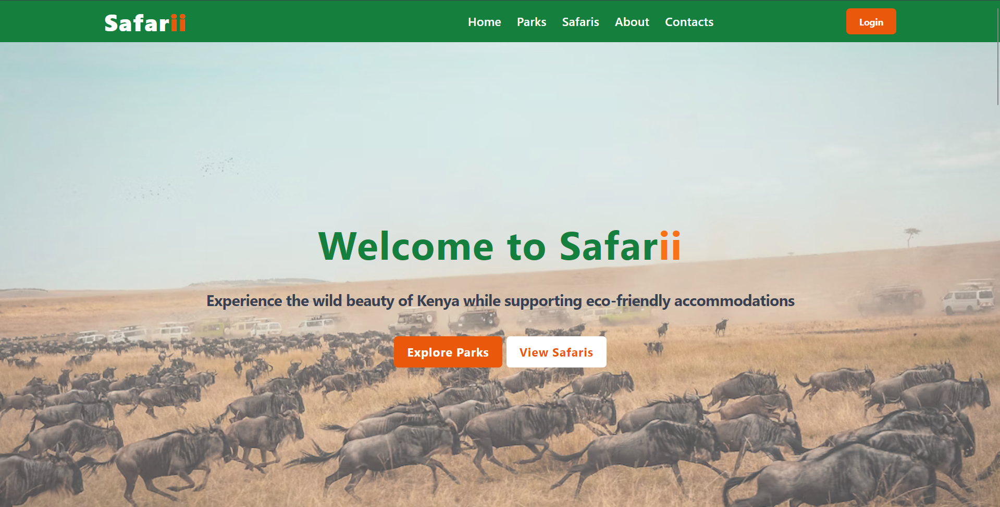
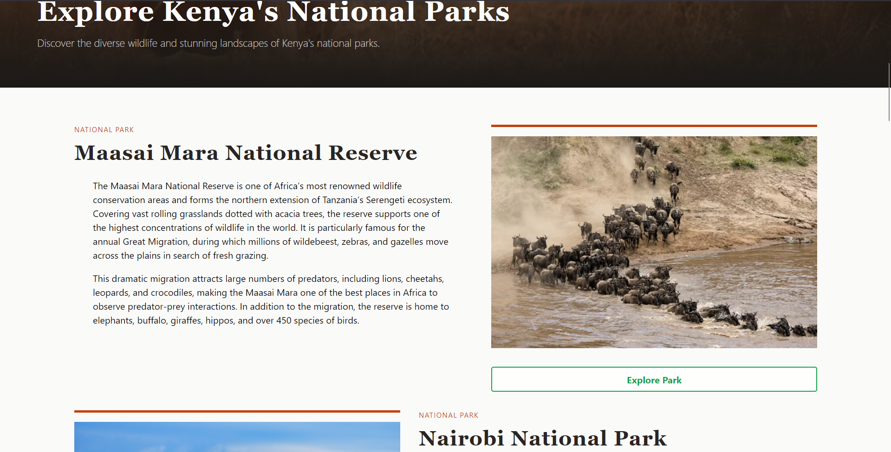
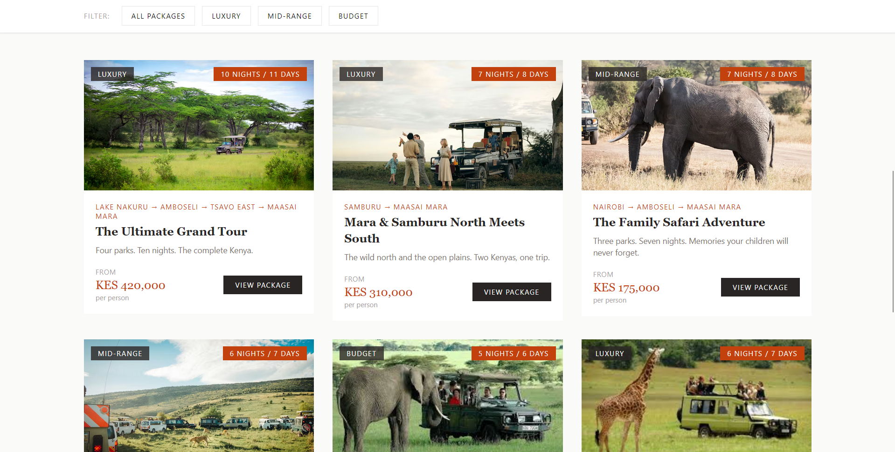
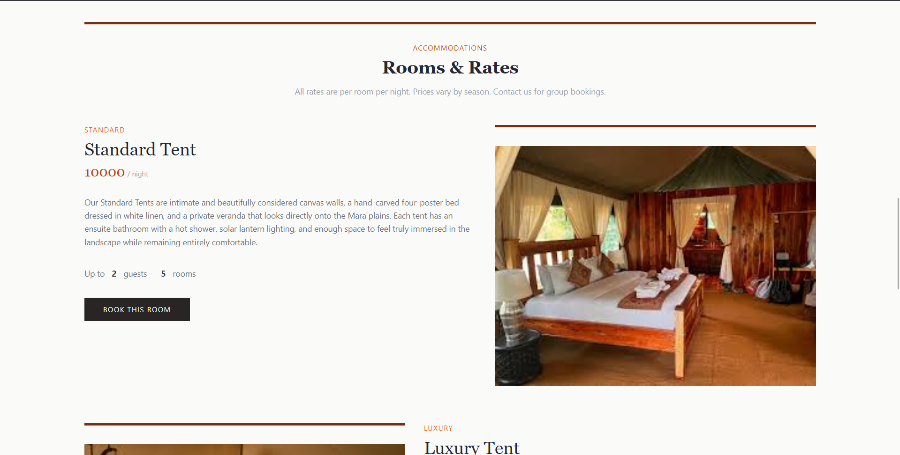

# Safarii — Kenya Safari Discovery Platform

Safarii is a frontend safari travel platform for discovering Kenya's national parks, lodges, and curated safari packages. The project is built with HTML, Tailwind CSS, and vanilla JavaScript as a single-page application, with no frameworks or build tools required. All content is loaded dynamically from JSON data files at runtime, making the platform fully data-driven and easy to maintain.

## Contributor

Isaac Ndungu

## Project Brief

Safarii is a data-driven safari discovery platform designed to make planning a Kenya safari simpler and more inspiring for travelers. The platform brings together information about national parks, eco-conscious lodges, and multi-park safari packages in one clean, consistent interface.

The platform follows a single-page application architecture with hash-based client-side routing. All content is loaded dynamically from JSON data files, meaning the interface updates without full page reloads and content can be updated without touching the codebase.

The application is structured around three main content areas:

- Parks - detailed pages for each national park including wildlife, activities, and entry fees
- Lodges - individual lodge profiles with room types, rates, eco ratings, and a booking system
- Safari Packages - curated multi-park packages with route timelines, pricing, and booking

## Core Features

Home Page

- Introduction to the platform with featured park cards and a wildlife highlights section

Parks Listing & Park Detail

- A listing of all 7 national parks with alternating image and text layout
  Individual park pages with wildlife highlights, activities grid, entry fees by residency, and lodge cards

Lodge Detail

- Full lodge profile including gallery, overview stats (total rooms, type, eco rating), and room listings with rates
  2-step booking modal with guest details form with validation, and a confirmation screen with a unique booking reference

Safari Packages

- Listing page with filter bar (All, Luxury, Mid-Range, Budget)
  Individual package pages with a journey route timeline, highlights, includes/excludes breakdown, and summary pricing card
  2-step booking modal matching the lodge booking flow

About, Contact & Static Pages

- About page covering the platform's story, mission, and mandate
  Contact page with a validated enquiry form

Authentication

- Register and login pages with form validation
  Session management using localStorage

## Technologies Used

- HTML5
- Tailwind CSS
- Vanilla JavaScript (ES6+)
- Font Awesome
- JSON

## Usage Instructions

1. Clone the repository

```bash
git@github.com:isaac-ndungu/vision-auto.git
```

2. Open the project folder.
3. Open index.html using Live Server (VS Code extension) or any local static file server.

## Screenshots






## Future Improvements

- Backend API integration for real booking persistence

- Availability calendar for lodge room bookings

- Reviews and ratings system

- Multi-language support — English and Swahili
  Expansion to include Tanzania and Uganda parks
